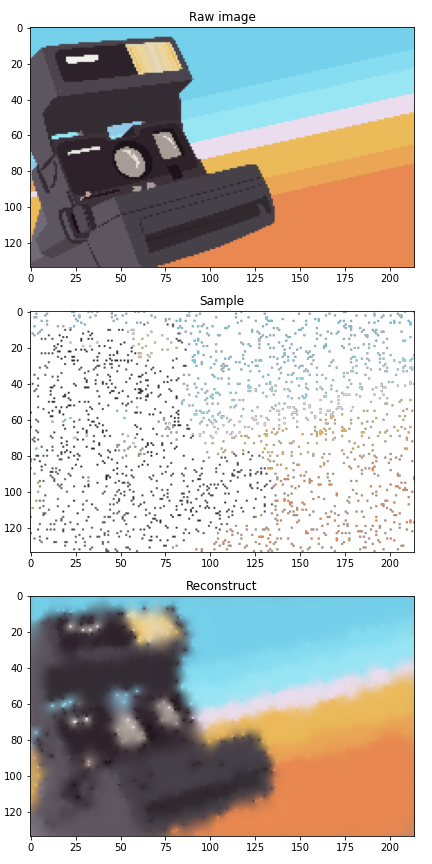
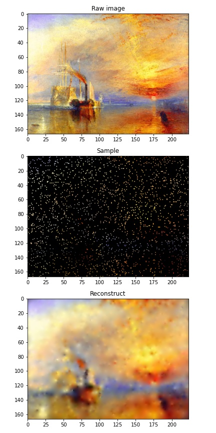
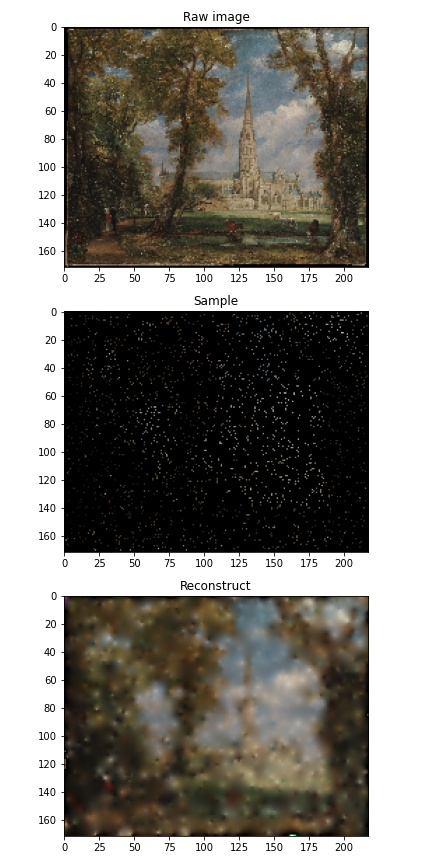
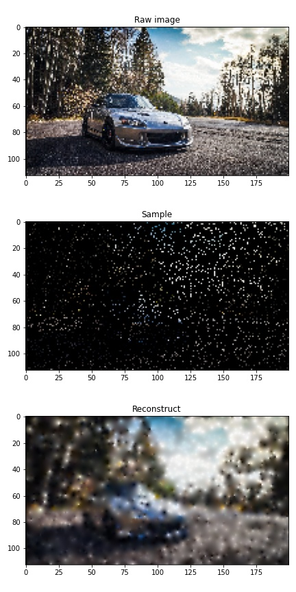
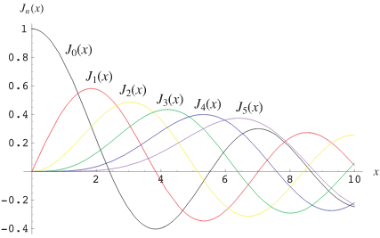

# 这个世界比我预想的更讲道理

我承认这是个标题党，因为本文既不是讨论逻辑问题，也不是讨论世界观问题。

但本文通过高斯过程在图像中的一个应用，说明仅使用图像的散碎局部信息，就可以用它们来还原整张图像。

---
- [这个世界比我预想的更讲道理](#这个世界比我预想的更讲道理)
  - [图像的随机采样与补全](#图像的随机采样与补全)
  - [Matern 核的高斯过程](#matern-核的高斯过程)
    - [Bessel 函数](#bessel-函数)

## 图像的随机采样与补全

这是个游戏，游戏过程很简单。我找到某张图像，之后随机从图像上取出一些像素点，这样随机取出的像素点即成为一些观测样本对，

$$
\begin{cases}
X^* &\in R^{n \times 2}\\
y^* &\in R^{n \times 3}
\end{cases}
$$

其中，$n$代表随机采样的数量，而 2 代表像素位置的两个坐标值，3 代表该像素的 RGB 数值。接下来，我使用高斯过程对未观测到的像素进行预测，即求解如下方程

$$
\begin{cases}
y=f(X)\\
\hat{f} = f(y |X, X^*, y^*)
\end{cases}
$$

游戏结果如下图所示。每张图都是一个 3 行的图，其中 Raw image 是原图，Sample 是从原图中随机提取的稀释像素点，Reconstruct 是从稀释随机像素中重建的图像。

这个结果表明“这个世界比我预想的更讲道理”，也就是说，我既没有让模型学习照相机、船、建筑和车的所谓语义信息，也没有将这些像素点通过特定的拓扑结构连接起来。我所做的，仅仅是认为图像的像素服从多元正态分布，而该分布的协方差来源仅仅是像素之间的位置关系。但就是在这样的“简陋”条件下，还原的图像竟然看上去跟原图有些相似性，这表明图像本身具有十分有趣的分布规律，而高斯过程方法可以用于找到并利用这些规律。

## Matern 核的高斯过程

上述高斯过程方法使用 Matern 核，而非之前介绍的 RBF 核。

> The **`[Matern](https://scikit-learn.org/stable/modules/generated/sklearn.gaussian_process.kernels.Matern.html#sklearn.gaussian_process.kernels.Matern)`** kernel is a stationary kernel and a generalization of the **`[RBF](https://scikit-learn.org/stable/modules/generated/sklearn.gaussian_process.kernels.RBF.html#sklearn.gaussian_process.kernels.RBF)`** kernel.
>

[1.7. Gaussian Processes](https://scikit-learn.org/stable/modules/gaussian_process.html)

该核函数比 RBF 核稍微复杂一些

$$
k(x,y)=\frac{1}{\Gamma(v)2^{v-1}}
\begin{pmatrix}
\frac{\sqrt{2v}}{l}d(x, y)
\end{pmatrix}^v \cdot K_v \cdot
\begin{pmatrix}
\frac{\sqrt{2v}}{l}d(x, y)
\end{pmatrix}
$$

其中，$\Gamma(v)$代表 Gamma 函数，$K_v$代表 Bessel 函数，$d(x,y)$代表样本之间的欧氏距离。它具有一个挺有意思的性质，即$v=1/2$时它与 RBF 核等价

$$
k_{v=1/2}(x, y) = exp
\begin{pmatrix}
-\frac{1}{l} d(x, y)
\end{pmatrix}
$$

### Bessel 函数

该函数也是一个巨坑，它的形式如下，是个围道积分。由于被积函数在复空间上具有极点，因此我们可以使用留数定理解决这个问题，而无须过分考虑积分路径。

$$
J_v(z)=\frac{1}{2\pi i}\oint e^{(z/2)(t-1/t)} t^{-v-1} dt
$$

另外，Bessel 函数所具有的一个数学意义是如下方程的解。

> The Bessel functions of the first kind are defined as the solutions to the [Bessel differential equation](https://mathworld.wolfram.com/BesselDifferentialEquation.html)
>

$$
x^2\frac{d^2y}{dx^2} + x\frac{dy}{dx} + (x^2-n^2)y = 0
$$

[Bessel Differential Equation -- from Wolfram MathWorld](https://mathworld.wolfram.com/BesselDifferentialEquation.html)